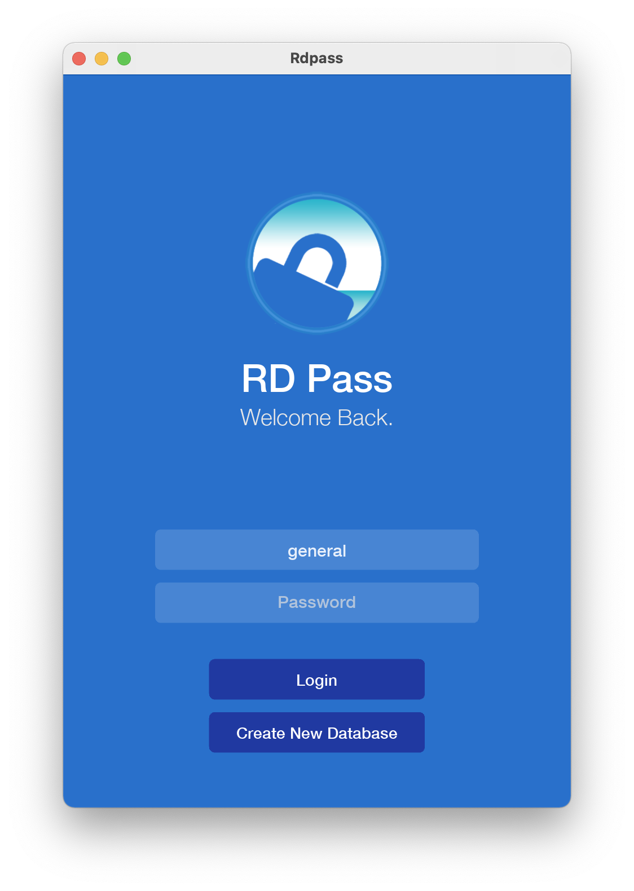
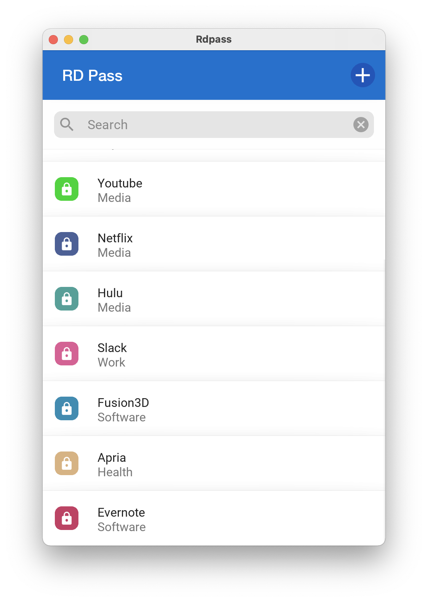
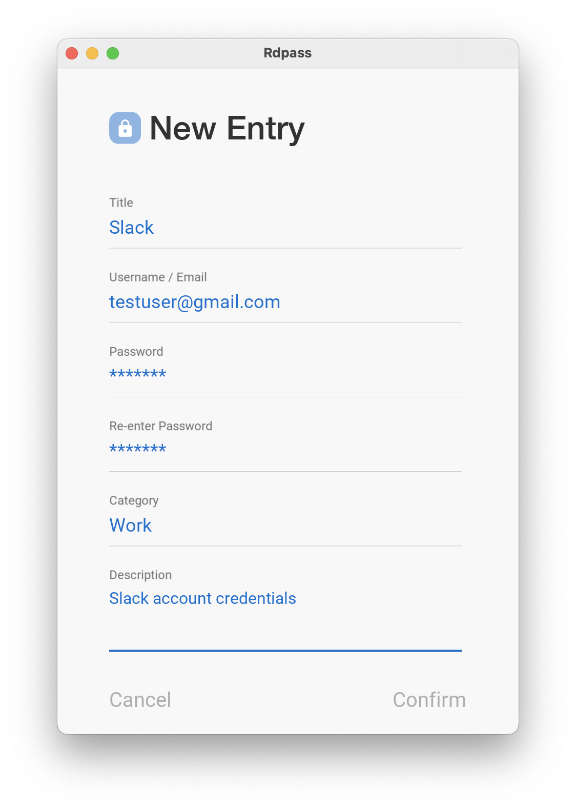
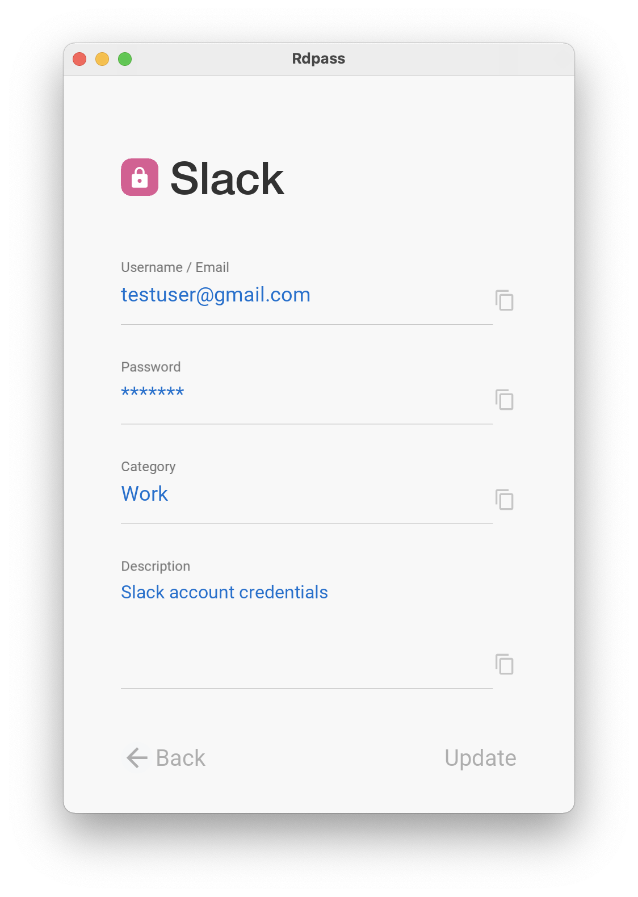

# RDPass GUI

RD Pass is a password manager application developed using the python Kivy framework. It uses a SQL database to store the credential entries with AES encryption. This repo is built on the command-line version of RDPass. The command-line only version can be found under my repo ./Exercise_projects/RDPass.

## Installation

RDPass dependencies:
* kivy
* kivymd
* py-bcrypt
* pycryptodome

Versions that I used are listed in requirements.txt. Run this command to install the dependencies:

    pip install -r requirements.txt

## Usage

To run:

    python kivy_rdpass.py

The password for the "general" testing database: "1234".

## Database

The databases and the configuration files are stored in ./db_storage and ./config_storage, respectively.

## To-do

* ~~Add confirm delete message dialog before deleting entry~~
* ~~Add search bar and search function in the menu~~
* Add a delete database function, currently database can be deleted directly from ./db_storage

